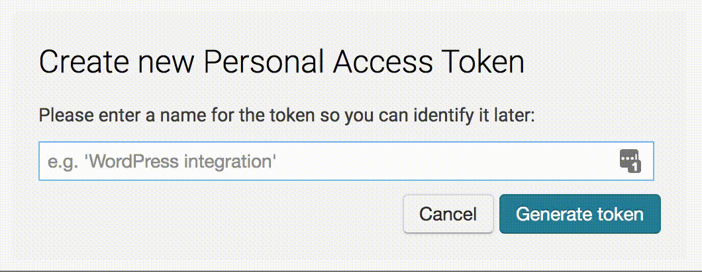

# pkgdown 
# DatawRappr

The goal of DatawRappr is to provide a wrapper for Datawrapper's API to connect data from R directly with Datawrapper's charts capabilities. It uses the new [API version 3.0](https://developer.datawrapper.de/v3.0/docs).

## Key features:

* Manages and automatically retrieves the API-key locally via `datawrapper_auth()`
* Creates, deletes or publishes charts on Datawrapper
* Sends Dataframes from R directly to Datawrapper - without having to copy them in - with `dw_data_to_chart()`

All functions (except `datawrapper_auth()`) are preceded by `dw_`:

* allows test calls to the API via `dw_test_key()`
* lists all created charts: `dw_list_charts()`.
* lists all folders: `dw_list_folders()`.
* creates a new Datawrapper chart via `dw_create_chart()`
* adds data from a R-dataframe to an existing Datawrapper chart via `dw_data_to_chart()`
* retrieves (`dw_retrieve_chart_metadata()`) or edits metadata, description and visualization of an existing chart via `dw_edit_chart()`
* publishes and republishes a Datawrapper chart via `dw_publish_chart()`
* deletes an Datawrapper chart via `dw_delete_chart()`

## Installation

Right now this package is experimental and only available on Github:

```{r}
# install.packages("devtools") # if not already installed on your system
devtools::install_github("munichrocker/DatawRappr")
```

## Usage

```{r}
library(DatawRappr)
```

### Setting up the API-key

To use the API you have to create an API key on Datawrapper.

Click on **Dashboard** - **Settings** and move down to the section that says **API Access Tokens**.

Click on **Create new personal access token**, enter a name and save the token:



Copy the API key in the clipboard and use

```{r}
datawrapper_auth(api_key = "12345678")
```

to save the key to our system. If a key already exists, you may add the argument `overwrite = TRUE` to `datawrapper_auth()`.

To make sure, your key is working as expected, you can run

```{r}
dw_test_key()
```

with no arguments. It will then use the saved key from the environment. If the key is correct, you will receive a response from the API with personal details about your account - a `dw_user`-object that has no further use than to check your key.

Note: If you want to see your currently saved API key, you may use the helper function `dw_get_api_key()`.

Congratulations, you're good to go!

### Making API-calls

#### Create a chart

To **create an empty chart**, you can use

```{r}
dw_create_chart()
```

which will use the API key stored locally on your system. 

By default, Datawrapper will create an empty linechart, without a title. The function returns a **dw_chart**-object with the metadata-elements from the API. This object can be used to populate the `chart_id`-argument in all other functions - which means you don't have to deal with it. Just store the response from `dw_create_chart()` in your R-environment.

#### Add data to the chart

To populate that chart with data, you can run

```{r}
dw_data_to_chart(x = DATAFRAME, chart_id = CHART_ID_OR_dw_chart-object)
```

which uploads an R data.frame to an Datawrapper chart. 

The data.frame should already be in the right format, only including the expected columns for the chart. The API will asume, that the first row contains headers. If that's not true, you have to edit the metadata afterwards:

#### Edit chart's metadata

```{r}
dw_edit_chart(chart_id = CHART_ID_OR_dw_chart-object, title = "I'm a title", 
data = list(`horizontal-header` = "false"))
```

Datawrapper offers a lot of variability in editing it's charts' metadata. You can find a whole [Documentation here](https://developer.datawrapper.de/docs/chart-properties-1).

To speed things up, the `dw_edit_chart()`-function has some built-in arguments for common transformations:

* `title`
* `intro` which is the text below the title
* `annotate` which is the text below the plot
* `source_name` which states the source
* `source_url` which links to the source - but only if a `source_name` is provided.

If you want to edit specific arguments in your plot, you can use the arguments `data`, `visualize`, `describe` and `publish` to include lists to the API call which change all possible settings in a chart, as shown in the example above.

When you're finished editing your chart, you might want to publish it:

```{r}
dw_publish_chart(chart_id = CHART_ID_OR_dw_chart-object)
```

This function returns a URL to the chart and the embed code, if you set the argument _return_urls_ to `TRUE`.

#### Delete chart

Or you might want to delete a chart:

```{r}
dw_delete_chart(chart_id = CHART_ID_OR_dw_chart-object)
```

## Under the hood

This package makes heavy use of the [`httr`](https://github.com/r-lib/httr)-package, which on itself is a wrapper of the [curl](https://cran.r-project.org/web/packages/curl/index.html)-package.

## Further Links

There is a [API-documentation](https://developer.datawrapper.de/reference) and a [Getting Started guide with examples](https://developer.datawrapper.de/docs/getting-started) from Datawrapper.

A full Package-documentation [can be found here](https://munichrocker.github.io/DatawRappr/).
